<h3><code>jayesh@github ~ $ ./contributions.sh</code></h3>

  
<h3><code>jayesh@github ~ $ whoami</code></h3>
<table>
  <tr>
    <td valign="top"></td>
    <td valign="top"></td>
  </tr>
</table>
 
<h3><code>jayesh@github ~ $ cat tech_stack.md</code></h3>

#### 🧠 AI & GenAI
`Python` • `LangChain` • `RAG Pipelines` • `Vector DBs` • `TensorFlow` • `Keras` • `Scikit-Learn` • `OpenCV` • `YOLOv8`

#### ⚡ Backend & Cloud
`FastAPI` • `Django` • `REST APIs` • `PostgreSQL` • `GCP` • `Docker` • `Streamlit`

#### 🛠 Automation & Tools
`Git` • `Playwright` • `Selenium` • `VS Code` • `Jupyter` • `Figma` • `Premiere Pro`

---

<h3><code>jayesh@github ~ $ ./socials.sh</code></h3>

  <a href="https://jayesh-pf.me/" target="_blank"><b>Portfolio</b></a> •
  <a href="https://www.linkedin.com/in/cmd-jayesh" target="_blank"><b>LinkedIn</b></a> •
  <a href="https://youtube.com/@jey_script" target="_blank"><b>YouTube</b></a> •
  <a href="https://www.instagram.com/jeyy.sh/" target="_blank"><b>Instagram</b></a> •
  <a href="mailto:jayeshvishwakarma6028@gmail.com"><b>Email</b></a>

